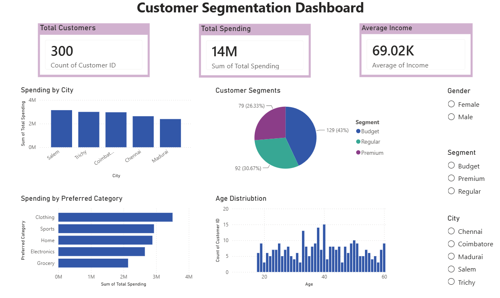

# Customer-Segmentation-Dashboard
A Power BI dashboard for customer segmentation analysis using Excel data, featuring KPIs, interactive charts, and slicers.
# 👥 Customer Segmentation Dashboard


---

## 📌 Project Overview

This project presents an interactive **Customer Segmentation Dashboard** built using **Microsoft Power BI**.

The dashboard helps analyze customer behavior by visualizing spending patterns, customer segments, income, age distribution, and city-wise spending.

---

## 🎯 Objectives

- Analyze customer spending patterns
- Identify customer segments
- Compare spending across cities
- Explore preferred product categories
- Create an interactive dashboard using Power BI

---

## 🛠 Tools Used

- Microsoft Power BI
- Microsoft Excel

---

## 📊 Dashboard Features

- 📌 Total Customers KPI
- 💰 Total Spending KPI
- 💵 Average Income KPI
- 📍 Spending by City
- 🛒 Spending by Preferred Category
- 🥧 Customer Segments (Pie Chart)
- 📈 Age Distribution
- 🎛 Interactive Slicers (Gender, Segment, City)

---

## 📷 Dashboard Preview

> Upload your dashboard screenshot as **dashboard.png** in this repository.



---

## 📂 Repository Structure

```
Customer-Segmentation-Dashboard/
│
├── Customer_Segmentation_Dashboard.pbix
├── Customer_Data.xlsx
├── dashboard.png
└── README.md
```

---

## 📈 Key Insights

- Total Customers: **300**
- Total Spending: **14M**
- Average Income: **69.02K**
- Customer segments include Budget, Regular, and Premium.
- Dashboard supports interactive filtering by City, Gender, and Segment.

---

## 🚀 Skills Demonstrated

- Data Visualization
- Dashboard Design
- KPI Reporting
- Data Analysis
- Power BI
- Excel
- Interactive Reports

---

## 👩‍💻 Author

**Kalai Vani**

B.Tech Student | Aspiring Data Scientist

GitHub: https://github.com/YOUR_USERNAME

LinkedIn: https://www.linkedin.com/in/YOUR_LINKEDIN

---

⭐ If you found this project helpful, consider giving it a star!
